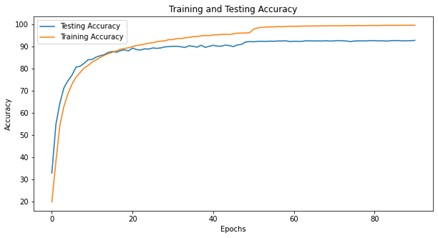
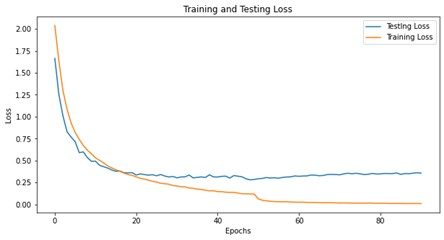

# Deep Learning Based Image Classification Network 

- We trained deep learning based image classification networks (AlexNet, VGG16, VGG19) for CIFAR-10 dataset. 

- We analyzed the effects of various hyperparameters (batch size, activation functions, learning rate, epochs, convolutional depth, data augmentations & batch normalization) on train and test accuracies.

Results:
------- 
We were able to achieve best test accuracy of 92.85% for VGG19 network.  

 
Fig. 1. Plot for Training and Testing Accuracies.

 
Fig. 2. Plot for Training and Testing Losses.

